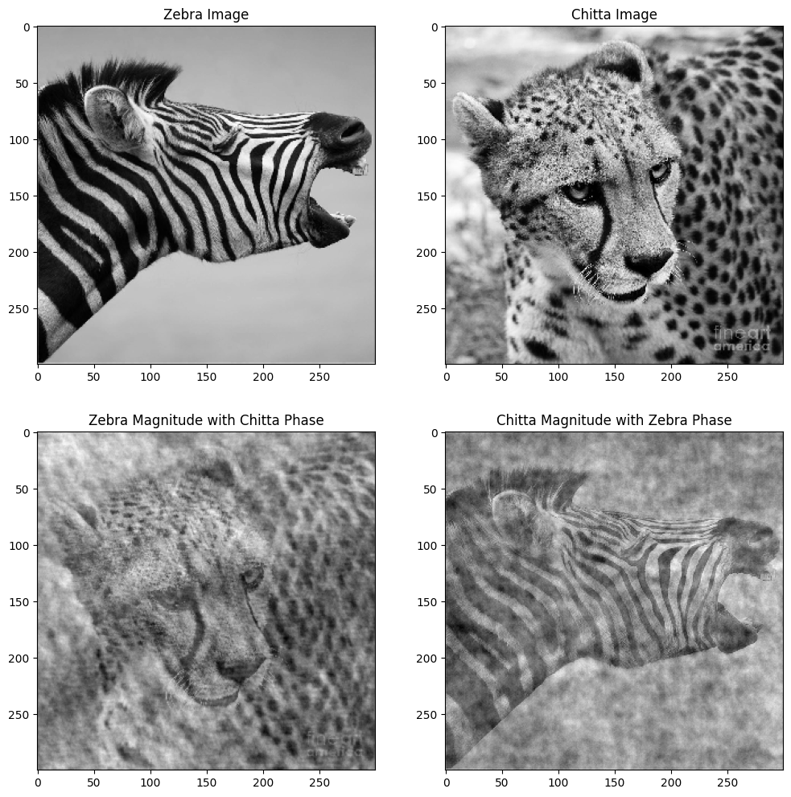
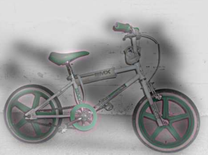

# Fourier Transform of Images
<p align="center">
   
</p>
Why is this image so strange, Lincon or a person looking out of window? Let us understand using fourier transforms...

## What is fourier transform?
This can be explained through this images.

<p align="center">
  
</p>
In the first image (on the left), when you traverse along the X-axis, you won't observe any variation in color throughout the image. However, if you move along the Y-direction, you'll notice changes in color occurring at certain intervals. Consequently, the Fourier transform plot (on the right) of this image exhibits a predominantly vertical pattern.

<p align="center">
  
</p>
Now, in the second image (on the left), when you traverse along the X-axis, you will observe variations in color along the X-axis. If you move along the Y-direction, you will observe even higher frequency color changes. This results in the Fourier transform plot displaying a rectangle shape with a smaller width and greater height, which we find visually appealing.

What type of image corresponds to a square Fourier plot? It's an image with equal frequency changes in both the X and Y directions, as illustrated below.

<p align="center">
  
</p>


The idea behind the Fourier transform of an image is to break down the image into its component frequencies. Instead of representing the image as a grid of pixel values, the Fourier transform represents the image as a sum of sinusoidal functions of different frequencies and amplitudes. These sinusoidal functions are characterized by their spatial frequency (how rapidly they oscillate across the image) and their phase (where they start in their cycle).

## The Magnitude and the Phase Plot

The magnitude plot of the Fourier Transform represents the amplitude or strength of various spatial frequency components in the image. It is also known as the amplitude spectrum. In the context of image analysis, the magnitude plot helps us understand which spatial frequencies are prevalent in the image and to what extent. High values in the magnitude plot indicate the presence of prominent features or patterns at the corresponding spatial frequencies.


<p align="center">
  
  <br>
  The magnitude plot represents the strength of frequency component, phase plot represents the relative change in frequency
</p>

```python
##############  MAGNITUDE-PHASE PLOTS ###################

import numpy as np

dft = np.fft.fft2(image) # Fast Fourier transform
magnitude = np.abs(dft) # Magnitude of the FFT 
phase = np.angle(dft) # Phase of the FFT

################################################################
```

The phase plot of the Fourier Transform represents the phase information associated with each spatial frequency component. The phase is the angle information associated with each frequency component and describes the relative positions and orientations of patterns in the image. It provides information about the position and orientation of edges, patterns, and textures in the image.

# Low-Pass, High-Pass, and Band-Pass Filters

<p align="center">
  
  <br>
  Lincoln in Dalivision (1977)
</p>


## Low-Pass, High-Pass & Band-Pass Filters

In this section, we'll discuss low-pass, high-pass, and band-pass filters used in image processing.

### Low-Pass Filter

A low-pass filter allows low-frequency components to pass through while attenuating or removing high-frequency components. In the context of images, low-frequency components correspond to smooth, slowly changing areas of the image, such as gradients, edges, and textures. Low-pass filtering is used for tasks like noise reduction and blurring. It can make images appear smoother and less detailed.

```python
# Define Butterworth low-pass filter function
def butterworth_low_pass(rows, cols, center_row, center_col, cutoff, n=1):
    x = np.arange(cols) - center_col
    y = np.arange(rows) - center_row
    xx, yy = np.meshgrid(x, y)
    distance = np.sqrt(xx ** 2 + yy ** 2)
    # Butterworth low-pass filter formula
    filter = 1 / (1 + (distance / cutoff) ** (2 * n))
    return filter
```

### High-pass filter

A high-pass filter allows high-frequency components to pass through while attenuating or removing low-frequency components. In image processing, high-frequency components represent fine details, sharp edges, and textures. High-pass filtering can be employed for tasks like edge detection and enhancing fine details in an image.

### Band-pass filter

A band-pass filter allows a specific range of frequencies to pass through while attenuating both low and high frequencies. In image processing, band-pass filtering can be useful for isolating features within a particular frequency range. It retains only the mid-frequency details. Bandpass filters are often used in tasks like texture analysis, image segmentation, and feature extraction.

<p align="center">
  
  <br>
  we can see that lincon features are more dominant after low-pass filtering, while features of lady and window become more prominent after high-pass filtering as those feature corresponds to higher spacial frequency.
</p>

<p align="center">
  
</p>

As another illustration, it becomes evident that a low-pass filter induces image blurring, a high-pass filter assumes responsibility for enhancing sharp edges, and, within the bandpass filter, the resultant output reveals edges accompanied by variations in shadow and light.


## Phase swapping

Phase is often more informative and perceptually significant than the magnitude. The phase of an image is more critical than its magnitude for perception and feature identification is known as the Phase Congruency Theory. 
<p align="center">
  
  <br>
  Phase of the image is more responsible for the textures and main fetures of the images
</p>

```python
########################## PHASE SWAP ###################

# Swap the phases while keeping the magnitudes the same
zebra_chitta_dft = np.zeros_like(zebra_dft)
zebra_chitta_dft[:, :, 0], zebra_chitta_dft[:, :, 1] = cv2.polarToCart(zebra_magnitude, chitta_phase)
chitta_zebra_dft = np.zeros_like(chitta_dft)
chitta_zebra_dft[:, :, 0], chitta_zebra_dft[:, :, 1] = cv2.polarToCart(chitta_magnitude, zebra_phase)

# Perform the inverse DFT to obtain the swapped images
zebra_chitta_swapped = cv2.idft(zebra_chitta_dft, flags=cv2.DFT_SCALE | cv2.DFT_REAL_OUTPUT)
chitta_zebra_swapped = cv2.idft(chitta_zebra_dft, flags=cv2.DFT_SCALE | cv2.DFT_REAL_OUTPUT)
    
################################################################
```

In figure phase and magnitude is extracted from both the images, after swapping the phases and magnitudes. they are reconstructed by performing \textit{Inverse fourier transform}. We get two new image plots: one with the magnitude of the Zebra image and the phase of the Chitta image, and the other with the magnitude of the Chitta image and the phase of the Zebra image. We can see even after swapping with magnitude and phase, Phase features are dominant after reconstruction.

## Hybrid images

Hybrid image is a technique which creates static images with two interpolation, that change is function of viewing distance from the image. This rely on the concept of frequency components in images to create an intriguing perceptual effect. These images appear different when viewed from various distances due to the way our visual system processes different frequencies. The basic idea behind hybrid images is to combine two images, one with high-frequency components and another with low-frequency components.

```python
################### HYBRID IMAGES ##############################

# Apply Gaussian blur to the far image (low-pass filter)
far_img_blurred = cv2.GaussianBlur(far_img, (15, 15), 15)
# Apply unsharp mask to the close image (high-pass filter)
close_img_sharpened = cv2.addWeighted(close_img, 2.0, cv2.GaussianBlur(close_img, (0, 0), 25), -1.0, 0)

# Combine the two images to create the hybrid image
hybrid_img = cv2.addWeighted(far_img_blurred, 0.78, close_img_sharpened, 0.22, 0)    
################################################################
```

<p align="center">
  
  
  <br>
  High frequncy components make chitta when looked closely, low frequncy is contrubting to show zebra when lookd from far,
</p>

Low-Frequency Image: The low-frequency image contains larger, more gradual changes in intensity or color. These components include features like the overall shape, contours, and general structure of an object or scene.

High-Frequency Image: The high-frequency image contains smaller, rapid changes in intensity or color, such as fine details, texture, and sharp edges. This image often appears noisy or granular.

Hybrid images are created through the combination of two images at two distinct spatial frequencies. The low-spatial frequency component is derived by convolving one image with a low-pass filter, while the high-spatial frequency component is obtained by convolving another image with a high-pass filter.

In this figure Chitta feature is more dominant when looked closely, Zebra features become more prominent when you look it from far.

## Hybrid images examples in the original paper

<p align="center">
  
  <br>
  Smiling or frowning ?
</p>

<p align="center">
  
  <br>
  A motorcycle or a bicycle ?
</p>

<p align="center">
  
  <br>
  Einstein or Marilyn?
</p>


## Credits
Oliva, A., Torralba, A., & Schyns, P. G. (2006). Hybrid images. ACM Transactions on Graphics (TOG), 25(3), 527-532.

I used chatgpt to refine the language.

Some material in this blog is referred from the class EEE 515 by [Dr Suren Jaysurya](https://search.asu.edu/profile/3183646) at ASU 
